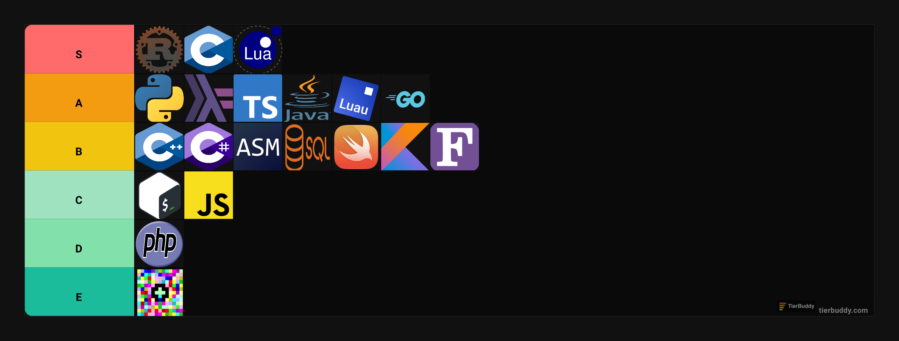

- ⚡ Fun fact: You should use Neovim 💚
- 👀 I’m interested in Rust 🦀

Programming languages tier list

Some useful mathematical things

 
- Gaussian Integral: $\int_{-\infty}^{\infty} e^{-x^2} dx = \sqrt{\pi}$
- Common trigonometric identities:
  - $\sin(A+B) \equiv \sin(A)\cos(B) + \sin(B)\cos(A)$
  - $\cos(A+B) \equiv \cos(A)\cos(B) - \sin(A)\sin(B)$
  - $\tan(A+B) \equiv \frac{\tan(A) + \tan(B)}{1 - \tan(A)\tan(B)}$

<!---
Finnian-Walsh/Finnian-Walsh is a ✨ special ✨ repository because its `README.md` (this file) appears on your GitHub profile.
You can click the Preview link to take a look at your changes.

- 👋 Hi, I'm @Finnian-Walsh
- 🌱 I’m currently (unknown)
- 💞️ I’m not looking for much
- 📫 How to reach me walshfinnian@gmail.com
- 😄 Pronouns: he/him
--->
